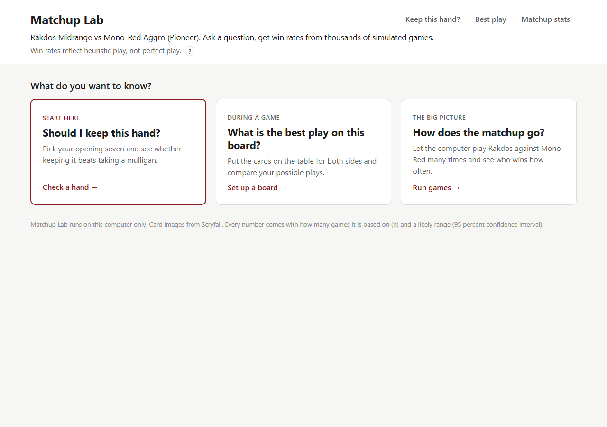
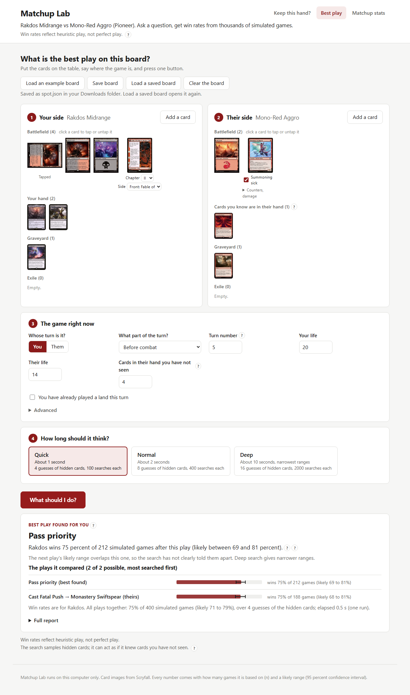

# Matchup Lab

 

Matchup Lab answers three questions about one Magic: The Gathering matchup, **Rakdos Midrange vs Mono-Red Aggro (Pioneer)**, by playing the game thousands of times on your own computer:

- Should I keep this opening hand?
- What is the best play on this board?
- How does the matchup go overall?

It runs on your computer, in your browser, and needs no command line. The computer players use rules of thumb, so every answer says how many games it rests on and how sure it is. Win rates reflect heuristic play, not perfect play.

## Get it running (Windows, about 5 minutes the first time)

You need Python and a web browser. Everything else is set up for you inside the project folder.

**Step 1. Install Python** (skip if you already have it)

1. Open https://www.python.org/downloads/ and click the yellow **Download Python** button.
2. Run the file it downloaded.
3. On the first screen, tick **Add python.exe to PATH**, then click **Install Now**.
4. When it says "Setup was successful", click **Close**.

**Step 2. Download Matchup Lab**

1. Open https://github.com/ucsandman/matchup-lab.
2. Click the green **Code** button, then **Download ZIP**.
3. In your Downloads folder, right-click **matchup-lab-main.zip**, choose **Extract All**, then click **Extract**.

**Step 3. Start it**

1. Open the extracted folder. Inside is another folder named **matchup-lab-main**; open that too. You should see **Launch.bat** and this README.
2. Double-click **Launch.bat**.
3. If Windows says "Windows protected your PC", click **More info**, then **Run anyway**.
4. A black window opens and prints what it is doing. The first time it downloads and builds for a few minutes. Later starts take a few seconds.
5. Your browser opens the Matchup Lab page by itself. If it does not, look in the black window for the address in a box (normally http://127.0.0.1:3456/) and type it into your browser.

Leave the black window open while you use the page. To stop, close the black window.

**On a Mac:** in Step 3 double-click **launch.command** instead. If macOS refuses to open it, right-click it, choose **Open**, then click **Open**.

## Using the page

Three cards, one for each question. Click one to start. The links at the top right switch between them.

**Should I keep this hand?** (start here)

1. Click your seven cards in the Rakdos Midrange list. They appear in your hand with a counter (7 of 7). Click a card in the hand to put it back.
2. Choose **On the play** or **On the draw**.
3. Choose how many mulligans you have already taken.
4. Press **Should I keep it?** and wait for the games to run (about 20 to 40 seconds).

The answer is a big **KEEP**, **MULLIGAN** or **TOO CLOSE TO CALL**, then one sentence with the numbers, for example: Keeping wins 58 percent of 100 simulated games (likely between 48 and 67 percent). Taking a mulligan wins 18 percent (likely between 12 and 27 percent).

**What is the best play on this board?**

1. On **Your side** and **Their side**, press **Add a card** and click the cards on the table. Click a card on the battlefield to tap or untap it.
2. Fill in **The game right now**: whose turn it is, what part of the turn, life totals, how many cards they hold that you have not seen.
3. Pick **Quick**, **Normal** or **Deep** (Deep takes about 10 seconds and gives the narrowest ranges).
4. Press **What should I do?**

The answer names the best play the search found, with its numbers, and lists every play it compared as a bar. **Load an example board** shows a finished example you can change.

**How does the matchup go?**

Pick which computer plays Rakdos, choose 100, 500 or 1000 games and press **Run the games**. You get the Rakdos win rate overall, on the play and on the draw, and the average game length.

## How to read the numbers

Every number comes with two things:

- **How many games it rests on (n).** 100 games gives a rough number, 1000 a solid one.
- **A likely range**, for example "likely between 48 and 67 percent". If you ran many more games, the true win rate for these computer players would most likely land inside it.

If two options' ranges overlap, the tool has not told them apart. Treat them as a tie. When that happens the page says so; pick a longer search or more games.

## If something goes wrong

- The black window prints a line starting with **PROBLEM** (what happened) and a line starting with **WHAT TO DO** (the one thing to try). Do that, then double-click Launch.bat again.
- Launch.bat says Python is missing: do Step 1, then try again. Make sure the **Add python.exe to PATH** box was ticked.
- The browser shows "This site can't be reached": the black window has been closed. Double-click Launch.bat again.
- The first start needs an internet connection (it downloads Node.js and card pictures). After that it works offline.
- Anything else: open an issue at https://github.com/ucsandman/matchup-lab/issues and paste the last lines from the black window.

## What it cannot do

- **It is not a solver.** Nothing it prints is "the correct play". The games are played by rule-of-thumb computer players, and the numbers say how a hand or a play does in their hands. It never claims optimal or perfect play.
- **It can act as if it saw your opponent's hand.** The board search guesses the hidden cards several times and plans each guess with every card face up, so plays that depend on guessing right (holding up removal, discard spells) can be rated too high or too low.
- **Game 1 only.** Both main decks, no sideboarding.
- **Two fixed lists.** Rakdos Midrange (olbeda, MTGO Pioneer Challenge, 2026-08-31) and Mono-Red Aggro (_ZNT_, MTGO Pioneer Challenge, 2026-09-26), as listed in decks/deckA.json and decks/deckB.json. No other cards exist in it.
- **The computer players have blind spots.** They look one move ahead and do not expect tricks in response. Details in docs/DEVELOPERS.md.

## For developers

Everything technical lives in [docs/DEVELOPERS.md](docs/DEVELOPERS.md): the PowerShell commands, each tool's flags and sample output, the full list of rules shortcuts, the determinization weakness, speed numbers, tests, and how to add a card. The design is in PLAN.md and the history in CHANGELOG.md.

---

Matchup Lab is unofficial Fan Content permitted under the Wizards of the Coast Fan Content Policy. Not approved or endorsed by Wizards. Card names, rules text and the comprehensive rules are the property of Wizards of the Coast; card images are served from Scryfall. The code is MIT licensed (see LICENSE).
